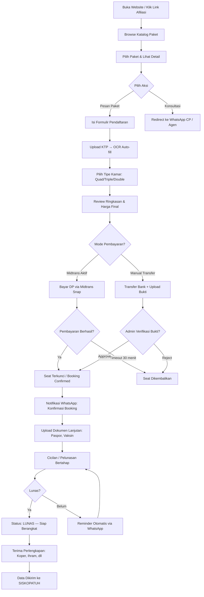
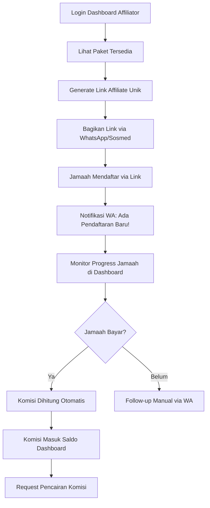
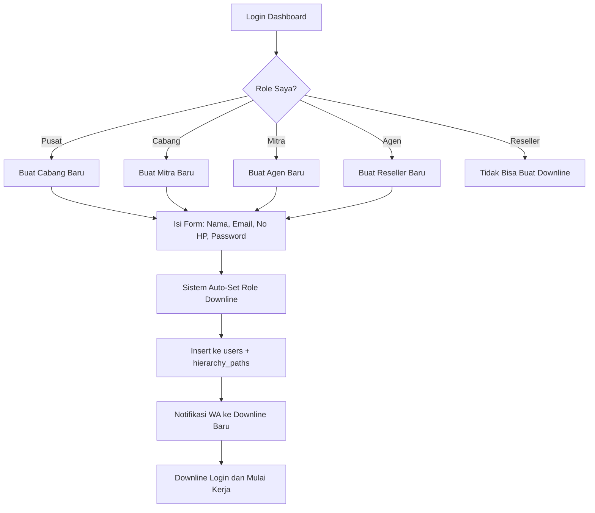
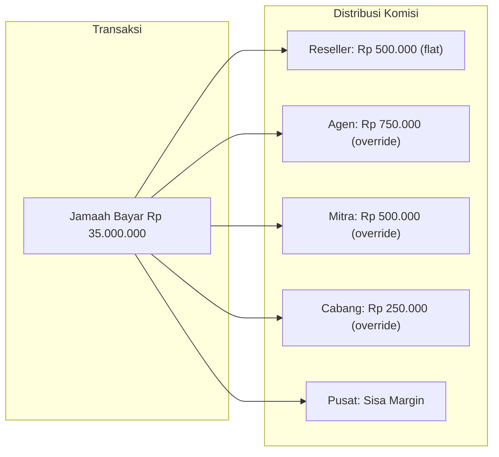
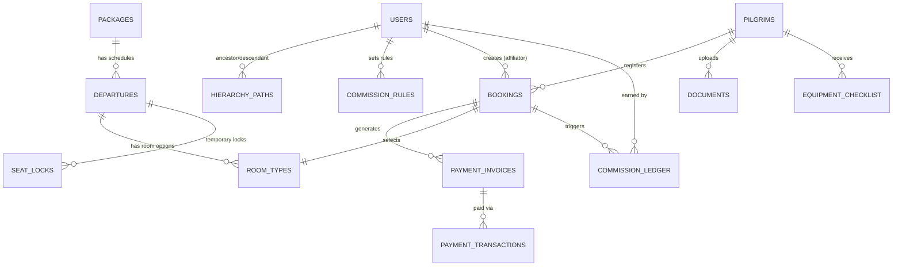
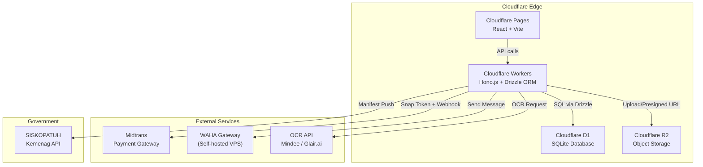

# PRD — Aplikasi Manajemen Haji & Umroh Terintegrasi

**Versi:** 1.0  
**Tanggal:** 20 Februari 2026  
**Peran:** Product Manager Senior  
**Status:** Draft — Menunggu Review

---

## 1. Ringkasan Eksekutif

Aplikasi ini adalah **platform end-to-end** untuk manajemen perjalanan Haji & Umroh yang mencakup:

- Katalog paket & pemesanan oleh jamaah
- Sistem afiliasi **5 tingkat** (Pusat → Cabang → Mitra → Agen → Reseller) dengan komisi dinamis
- Pembayaran bertahap via Midtrans **atau Transfer Manual** (auto-fallback)
- Manajemen kamar, inventaris seat, perlengkapan, dan dokumen
- Otomasi komunikasi WhatsApp (WAHA)
- Ekspor data SISKOPATUH & manifest maskapai
- OCR untuk KTP & Paspor

**Target pengguna utama**: Travel Agency Umroh (PPIU), jaringan afiliasi, dan calon jamaah.

---

## 2. User Flow

### 2.1. Flow Jamaah (Pilgrim)



**Langkah detail:**

| # | Langkah | Deskripsi |
|---|---------|-----------|
| 1 | **Akses Katalog** | Jamaah buka website atau klik link affiliate (`?ref=AGEN_XX`). Cookie server-side di-set selama 7 hari. |
| 2 | **Pilih Paket** | Lihat kartu paket dengan info: tanggal, maskapai, hotel, harga mulai, **progress bar kuota** (terisi/total). Filter berdasarkan bulan/harga/durasi. |
| 3 | **Detail Paket** | Halaman detail: fasilitas, syarat & ketentuan, kebijakan pembatalan, pilihan kamar. |
| 4 | **Pilih Kamar** | Quad (1 kamar ber-4), Triple (ber-3), Double (ber-2). Harga otomatis menyesuaikan. Jumlah orang (pax) per kamar bisa diatur. |
| 5 | **Formulir Pendaftaran** | Multi-section form (lihat detail kolom di bawah). |
| 6 | **Upload KTP** | Upload foto KTP → OCR extract → auto-fill data pribadi. Jamaah hanya verifikasi. File disimpan di R2 (private). |
| 7 | **Seat Locking** | Kuota seat dikurangi sementara (30 menit). Timer countdown ditampilkan. Progress bar kuota update real-time. |
| 8 | **Bayar DP** | Minimum DP (misal 30% atau Rp 5.000.000). **Jika Midtrans aktif**: Snap popup (VA, GoPay, OVO). **Jika manual**: tampilkan rekening tujuan + form upload bukti transfer. |
| 9 | **Konfirmasi** | **Midtrans**: Webhook → verifikasi signature → status "DP TERBAYAR". **Manual**: Admin review bukti → Approve/Reject. WhatsApp otomatis ke jamaah & agen. |
| 10 | **Cicilan Lanjutan** | Invoice bertahap dibuat otomatis. **Midtrans**: Jamaah bayar via link Snap. **Manual**: Jamaah transfer + upload bukti per invoice. |
| 11 | **Upload Dokumen** | Paspor, sertifikat vaksin meningitis, foto 4x6. OCR untuk paspor. |
| 12 | **Pelunasan** | Status berubah LUNAS. Sistem otomatis generate manifest SISKOPATUH. |
| 13 | **Distribusi Perlengkapan** | Admin centang checklist: koper ✅, kain ihram ✅, buku doa ✅, dll. |

#### Detail Kolom Formulir Pendaftaran

> Referensi: [pusat.almadinahms.com/registration](https://pusat.almadinahms.com/registration)

**Bagian A — Pilihan Produk**

| # | Label | Field Name | Tipe Input | Required | Keterangan |
|---|-------|------------|------------|----------|------------|
| 1 | Nama Lengkap | `name` | Text | ✅ | Nama sesuai KTP/Paspor |
| 2 | Pilihan Produk | `program` | Select / Dropdown | ✅ | Pilih paket umroh/haji |
| 3 | Tgl. Keberangkatan | `departure_date` | Date Picker | ✅ | Tanggal berangkat |
| 4 | Bandara Keberangkatan | `airport` | Select / Dropdown | ✅ | Bandara asal (CGK, SUB, dll) |
| 5 | Pilih Kamar | `rooms` | Card Selection | ✅ | Pilih opsi kamar (Quad/Triple/Double), kapasitas, jumlah kelipatan (pax) |

**Bagian B — Data Pribadi**

| # | Label | Field Name | Tipe Input | Required | Keterangan |
|---|-------|------------|------------|----------|------------|
| 6 | No. KTP | `no_ktp` | Text (16 digit) | ✅ | NIK sesuai KTP |
| 7 | Upload KTP | `ktp` | File Upload (image) | ✅ | Foto/scan KTP → trigger OCR auto-fill |
| 8 | Jenis Kelamin | `sex` | Select (Laki-laki / Perempuan) | ✅ | |
| 9 | Tempat Lahir | `born` | Text | ✅ | Kota tempat lahir |
| 10 | Alamat | `address` | Textarea | ✅ | Alamat lengkap sesuai KTP |
| 11 | Nama Ayah Kandung | `father_name` | Text | ✅ | Untuk keperluan paspor & visa |

**Bagian C — Data Paspor**

| # | Label | Field Name | Tipe Input | Required | Keterangan |
|---|-------|------------|------------|----------|------------|
| 12 | Memiliki Passport | `has_passport` | Toggle (Ya/Tidak) | ✅ | Jika "Tidak", bagian C.13-17 di-skip |
| 13 | Passport ID | `no_passport` | Text | Conditional | Nomor paspor |
| 14 | Upload Passport | `passport` | File Upload (image) | Conditional | Foto/scan halaman depan paspor → OCR |
| 15 | Tempat Dikeluarkan | `passport_from` | Text | Conditional | Kantor imigrasi penerbit |
| 16 | Tgl. Dikeluarkan | `passport_releaseAt` | Date Picker | Conditional | Tanggal terbit paspor |
| 17 | Masa Berlaku | `passport_expiredAt` | Date Picker | Conditional | Tanggal kadaluarsa paspor |

**Bagian D — Kontak & Status**

| # | Label | Field Name | Tipe Input | Required | Keterangan |
|---|-------|------------|------------|----------|------------|
| 18 | Status Pernikahan | `marital_status` | Select (Belum Menikah / Menikah / Cerai) | ✅ | Terkait syarat mahram |
| 19 | No. HP | `phone` | Text (telp) | ✅ | Nomor WhatsApp utama |
| 20 | No. Telp. Rumah | `home_phone` | Text (telp) | ❌ | Opsional |
| 21 | Pendidikan Terakhir | `last_education` | Select | ✅ | SD/SMP/SMA/D3/S1/S2/S3 |
| 22 | Pekerjaan | `work` | Text | ✅ | Jenis pekerjaan |
| 23 | Riwayat Penyakit | `disease_history` | Textarea | ❌ | Penyakit bawaan / alergi / kondisi khusus |

**Bagian E — Data Keluarga**

| # | Label | Field Name | Tipe Input | Required | Keterangan |
|---|-------|------------|------------|----------|------------|
| 24 | Nama Keluarga yg Ikut | `fam_member` | Dynamic List (Name + Hubungan) | ❌ | Bisa tambah/hapus anggota. Tombol "+" untuk tambah baris |
| 25 | Nama Kontak Darurat | `fam_contact_name` | Text | ✅ | Kontak darurat di Indonesia |
| 26 | No. Kontak Darurat | `fam_contact` | Text (telp) | ✅ | No. HP kontak darurat |

**Bagian F — Sumber Informasi**

| # | Label | Field Name | Tipe Input | Required | Keterangan |
|---|-------|------------|------------|----------|------------|
| 27 | Dari mana mengetahui kami? | `source_from` | Select | ❌ | Instagram / Facebook / YouTube / Teman / Website / Lainnya |

---

### 2.2. Flow Affiliator (Reseller/Agen/Mitra/Cabang)



**Detail per role:**

| Role | Bisa Membuat | Kemampuan Khusus |
|------|-------------|-----------------|
| **Pusat** | Cabang | Super Admin: CRUD semua paket, set harga dasar, kelola semua cabang, laporan global, ekspor SISKOPATUH, konfigurasi sistem. |
| **Cabang** | Mitra | Kelola Mitra di wilayahnya, laporan wilayah, manage kamar & seat alokasi. |
| **Mitra** | Agen | Kelola Agen downline, set komisi Agen, laporan regional. |
| **Agen** | Reseller | Kelola Reseller downline, set komisi Reseller, lihat performa tim. |
| **Reseller** | — | Generate link affiliate, lihat jamaah referral sendiri, lihat saldo komisi, request pencairan. |

#### 2.2.1. Self-Service Downline Creation (Setiap Jenjang Buat Bawahan Sendiri)

Setiap level di atas Reseller **dapat membuat akun downline langsung** dari dashboard mereka sendiri. Tidak perlu menunggu admin Pusat.



**Aturan hierarki:**

| Upline | Hanya bisa buat | Validasi |
|--------|----------------|----------|
| Pusat | Cabang | Email unik, max cabang configurable |
| Cabang | Mitra | Email unik, parent_id = cabang.id |
| Mitra | Agen | Email unik, parent_id = mitra.id |
| Agen | Reseller | Email unik, parent_id = agen.id |
| Reseller | — | Tidak bisa membuat siapapun |

**Form Buat Downline** (tampil di dashboard setiap jenjang kecuali Reseller):

| Label | Field | Tipe | Required |
|-------|-------|------|----------|
| Nama Lengkap | `name` | Text | Ya |
| Email | `email` | Email | Ya |
| No. HP / WhatsApp | `phone` | Text | Ya |
| Password Awal | `password` | Password | Ya |
| Kode Affiliate | `affiliate_code` | Text (auto-generate) | Ya |

> [!IMPORTANT]
> **Validasi Backend**: API `POST /api/users` akan **otomatis menentukan role downline** berdasarkan role upline yang login. Cabang tidak bisa membuat Agen langsung — harus lewat Mitra. Setiap user yang dibuat otomatis masuk ke Closure Table `hierarchy_paths`.

---

### 2.3. Flow Sistem Komisi (5 Tingkat)



**Mekanisme komisi:**

1. **Pusat** menetapkan **Harga Dasar (COGS)** per paket, misalnya Rp 30.000.000.
2. **Pusat** menetapkan **Total Margin** yang bisa didistribusikan, misalnya Rp 5.000.000.
3. Setiap tingkat di atas **mengalokasikan sebagian margin ke downline** mereka:
   - Cabang mendapat alokasi Rp 2.000.000 dari Pusat → ambil Rp 250.000, beri Rp 1.750.000 ke Mitra.
   - Mitra ambil Rp 500.000, beri Rp 1.250.000 ke Agen.
   - Agen ambil Rp 750.000, beri Rp 500.000 ke Reseller.
4. **Komisi bersifat dinamis**: setiap node bisa mengatur komisi downline-nya sendiri dalam batas yang diberikan oleh upline.
5. Saat transaksi terjadi, sistem query **Closure Table** → dapatkan seluruh upline → hitung komisi per tier → catat di `commission_ledger`.

> [!IMPORTANT]
> Setiap tier hanya bisa melihat dan mengatur komisi untuk **downline langsung** mereka. Cabang tidak bisa bypass Mitra untuk langsung set komisi Reseller.

---

## 3. Data Structure

### 3.1. Entity Relationship Diagram



### 3.2. Tabel-Tabel Utama

#### A. `users` — Semua pengguna sistem (hierarki 5 tingkat)

```sql
CREATE TABLE users (
  id            TEXT PRIMARY KEY DEFAULT (lower(hex(randomblob(16)))),
  email         TEXT UNIQUE NOT NULL,
  password_hash TEXT NOT NULL,
  full_name     TEXT NOT NULL,
  phone         TEXT,
  role          TEXT NOT NULL CHECK(role IN ('pusat','cabang','mitra','agen','reseller')),
  affiliate_code TEXT UNIQUE,          -- kode unik untuk link affiliate
  parent_id     TEXT REFERENCES users(id), -- upline langsung (adjacency)
  is_active     INTEGER DEFAULT 1,
  created_at    TEXT DEFAULT (datetime('now')),
  updated_at    TEXT DEFAULT (datetime('now'))
);
```

#### B. `hierarchy_paths` — Closure Table untuk hierarki MLM

```sql
CREATE TABLE hierarchy_paths (
  ancestor_id   TEXT NOT NULL REFERENCES users(id),
  descendant_id TEXT NOT NULL REFERENCES users(id),
  path_length   INTEGER NOT NULL DEFAULT 0,
  PRIMARY KEY (ancestor_id, descendant_id)
);

-- Contoh data:
-- Pusat(A) → Cabang(B) → Mitra(C) → Agen(D) → Reseller(E)
-- Rows: (A,A,0), (A,B,1), (A,C,2), (A,D,3), (A,E,4)
--        (B,B,0), (B,C,1), (B,D,2), (B,E,3)
--        (C,C,0), (C,D,1), (C,E,2)
--        (D,D,0), (D,E,1)
--        (E,E,0)
```

#### C. `commission_rules` — Aturan komisi per node

```sql
CREATE TABLE commission_rules (
  id              TEXT PRIMARY KEY DEFAULT (lower(hex(randomblob(16)))),
  user_id         TEXT NOT NULL REFERENCES users(id),  -- siapa yang SET aturan ini
  target_role     TEXT NOT NULL,                        -- role downline yang diatur
  package_id      TEXT REFERENCES packages(id),         -- NULL = berlaku global
  commission_type TEXT NOT NULL CHECK(commission_type IN ('flat','percentage')),
  commission_value REAL NOT NULL,                       -- nominal atau persentase
  created_at      TEXT DEFAULT (datetime('now'))
);
```

#### D. `packages` — Master paket Umroh/Haji

```sql
CREATE TABLE packages (
  id          TEXT PRIMARY KEY DEFAULT (lower(hex(randomblob(16)))),
  name        TEXT NOT NULL,           -- "UMROH FAMILY HOLIDAY PLUS TAIF 9 HARI"
  slug        TEXT UNIQUE NOT NULL,
  description TEXT,
  duration_days INTEGER NOT NULL,
  inclusions  TEXT,                    -- JSON: ["Visa","Mutawwif","Tiket PP", ...]
  exclusions  TEXT,                    -- JSON: ["Paspor","Vaksin Meningitis", ...]
  terms       TEXT,                    -- syarat & ketentuan
  cancellation_policy TEXT,
  thumbnail_url TEXT,                  -- R2 URL
  gallery     TEXT,                    -- JSON array of R2 URLs
  is_active   INTEGER DEFAULT 1,
  created_at  TEXT DEFAULT (datetime('now')),
  updated_at  TEXT DEFAULT (datetime('now'))
);
```

#### E. `departures` — Jadwal keberangkatan per paket

```sql
CREATE TABLE departures (
  id              TEXT PRIMARY KEY DEFAULT (lower(hex(randomblob(16)))),
  package_id      TEXT NOT NULL REFERENCES packages(id),
  departure_date  TEXT NOT NULL,         -- "2026-06-22"
  return_date     TEXT NOT NULL,
  airline         TEXT NOT NULL,         -- "Saudi Arabian Airlines"
  airline_code    TEXT,                  -- "SV"
  origin_airport  TEXT NOT NULL,         -- "CGK"
  origin_city     TEXT NOT NULL,         -- "Jakarta"
  hotel_madinah   TEXT,
  hotel_makkah    TEXT,
  total_seats     INTEGER NOT NULL,      -- total kuota seat
  booked_seats    INTEGER DEFAULT 0,     -- seat yang sudah terbooking
  base_price      REAL NOT NULL,         -- harga dasar (COGS) dari Pusat
  status          TEXT DEFAULT 'open' CHECK(status IN ('open','full','closed','departed')),
  -- STATUS AUTO-UPDATE: Saat booked_seats >= total_seats → status otomatis jadi 'full'
  created_at      TEXT DEFAULT (datetime('now')),
  updated_at      TEXT DEFAULT (datetime('now'))
);
```

> [!IMPORTANT]
> **Auto-Close Kuota**: Setiap kali booking dikonfirmasi, Worker menjalankan:
> ```sql
> UPDATE departures SET booked_seats = booked_seats + :pax, 
>   status = CASE WHEN booked_seats + :pax >= total_seats THEN 'full' ELSE status END
> WHERE id = :departure_id;
> ```
> Saat status = `'full'`, kartu paket otomatis menampilkan overlay "KUOTA PENUH" dan tombol pesan di-disable.

#### F. `room_types` — Tipe kamar per keberangkatan

```sql
CREATE TABLE room_types (
  id            TEXT PRIMARY KEY DEFAULT (lower(hex(randomblob(16)))),
  departure_id  TEXT NOT NULL REFERENCES departures(id),
  type          TEXT NOT NULL CHECK(type IN ('quad','triple','double')),
  price         REAL NOT NULL,        -- harga per pax untuk tipe kamar ini
  quota         INTEGER,              -- kuota kamar tipe ini (nullable = unlimited)
  booked_count  INTEGER DEFAULT 0
);
```

#### G. `pilgrims` — Data jamaah (sesuai form pendaftaran)

```sql
CREATE TABLE pilgrims (
  id                TEXT PRIMARY KEY DEFAULT (lower(hex(randomblob(16)))),
  -- Bagian B: Data Pribadi
  full_name         TEXT NOT NULL,          -- Nama Lengkap (sesuai KTP/Paspor)
  nik               TEXT,                   -- No. KTP (16 digit NIK)
  gender            TEXT CHECK(gender IN ('male','female')),  -- Jenis Kelamin
  place_of_birth    TEXT,                   -- Tempat Lahir
  date_of_birth     TEXT,                   -- Tanggal Lahir (dari OCR KTP)
  address           TEXT,                   -- Alamat lengkap
  father_name       TEXT,                   -- Nama Ayah Kandung (wajib untuk visa SA)
  -- Bagian C: Data Paspor
  has_passport      INTEGER DEFAULT 0,      -- Toggle: 0 = belum punya, 1 = sudah punya
  passport_number   TEXT,                   -- Passport ID
  passport_from     TEXT,                   -- Tempat Dikeluarkan (kantor imigrasi)
  passport_release_date TEXT,               -- Tgl. Dikeluarkan
  passport_expiry   TEXT,                   -- Masa Berlaku
  -- Bagian D: Kontak & Status
  marital_status    TEXT,                   -- Status Pernikahan
  phone             TEXT NOT NULL,          -- No. HP (WhatsApp utama)
  home_phone        TEXT,                   -- No. Telp. Rumah (opsional)
  education         TEXT,                   -- Pendidikan Terakhir
  occupation        TEXT,                   -- Pekerjaan
  disease_history   TEXT,                   -- Riwayat Penyakit
  -- Bagian E: Data Keluarga
  emergency_contact_name  TEXT,             -- Nama Kontak Darurat
  emergency_contact_phone TEXT,             -- No. Kontak Darurat
  family_members    TEXT,                   -- JSON: [{"name":"...","relation":"..."}, ...]
  -- Bagian F: Sumber Informasi
  registration_source TEXT,                 -- Dari mana mengetahui kami?
  created_at        TEXT DEFAULT (datetime('now')),
  updated_at        TEXT DEFAULT (datetime('now'))
);
```

#### H. `documents` — Dokumen jamaah (disimpan di R2)

```sql
CREATE TABLE documents (
  id          TEXT PRIMARY KEY DEFAULT (lower(hex(randomblob(16)))),
  pilgrim_id  TEXT NOT NULL REFERENCES pilgrims(id),
  doc_type    TEXT NOT NULL CHECK(doc_type IN ('ktp','passport','vaccine','photo','visa','other')),
  r2_key      TEXT NOT NULL,           -- object key di R2 bucket
  file_name   TEXT,
  mime_type   TEXT,
  ocr_result  TEXT,                    -- JSON hasil OCR
  verified    INTEGER DEFAULT 0,
  verified_by TEXT REFERENCES users(id),
  created_at  TEXT DEFAULT (datetime('now'))
);
```

#### I. `bookings` — Pemesanan

```sql
CREATE TABLE bookings (
  id              TEXT PRIMARY KEY DEFAULT (lower(hex(randomblob(16)))),
  booking_code    TEXT UNIQUE NOT NULL, -- "BK-20260622-001"
  pilgrim_id      TEXT NOT NULL REFERENCES pilgrims(id),
  departure_id    TEXT NOT NULL REFERENCES departures(id),
  room_type_id    TEXT NOT NULL REFERENCES room_types(id),
  pax_count       INTEGER NOT NULL DEFAULT 1,
  total_price     REAL NOT NULL,
  amount_paid     REAL DEFAULT 0,
  remaining       REAL GENERATED ALWAYS AS (total_price - amount_paid) STORED,
  status          TEXT DEFAULT 'pending' CHECK(status IN (
    'pending',          -- baru dibuat, belum bayar
    'seat_locked',      -- seat dikunci, menunggu DP
    'awaiting_verification', -- bukti transfer manual dikirim, menunggu admin verify
    'dp_paid',          -- DP terbayar
    'installment',      -- dalam cicilan
    'paid_full',        -- lunas
    'cancelled',        -- dibatalkan
    'refunded'          -- dikembalikan
  )),
  payment_mode    TEXT DEFAULT 'auto' CHECK(payment_mode IN ('auto','manual')),
  -- 'auto' = Midtrans, 'manual' = transfer bank + upload bukti
  -- Ditentukan otomatis saat booking dibuat berdasarkan ada/tidaknya MIDTRANS_SERVER_KEY
  affiliate_user_id TEXT REFERENCES users(id), -- affiliator yang merujuk
  seat_lock_expires TEXT,              -- waktu expired seat lock
  notes           TEXT,
  created_at      TEXT DEFAULT (datetime('now')),
  updated_at      TEXT DEFAULT (datetime('now'))
);
```

#### J. `seat_locks` — Kunci seat sementara

```sql
CREATE TABLE seat_locks (
  id            TEXT PRIMARY KEY DEFAULT (lower(hex(randomblob(16)))),
  departure_id  TEXT NOT NULL REFERENCES departures(id),
  booking_id    TEXT NOT NULL REFERENCES bookings(id),
  seats_locked  INTEGER NOT NULL,
  locked_at     TEXT DEFAULT (datetime('now')),
  expires_at    TEXT NOT NULL,          -- locked_at + 30 menit
  status        TEXT DEFAULT 'active' CHECK(status IN ('active','confirmed','expired','released'))
);
```

#### K. `payment_invoices` — Invoice cicilan bertahap

```sql
CREATE TABLE payment_invoices (
  id            TEXT PRIMARY KEY DEFAULT (lower(hex(randomblob(16)))),
  booking_id    TEXT NOT NULL REFERENCES bookings(id),
  invoice_code  TEXT UNIQUE NOT NULL,  -- "INV-20260622-001-DP"
  invoice_type  TEXT NOT NULL CHECK(invoice_type IN ('dp','installment','final','full')),
  amount        REAL NOT NULL,
  due_date      TEXT,
  status        TEXT DEFAULT 'unpaid' CHECK(status IN ('unpaid','pending','paid','overdue','cancelled')),
  payment_mode  TEXT DEFAULT 'auto' CHECK(payment_mode IN ('auto','manual')),
  -- Midtrans fields (hanya terisi jika payment_mode = 'auto')
  midtrans_order_id   TEXT,
  midtrans_snap_token TEXT,
  -- Manual transfer fields (hanya terisi jika payment_mode = 'manual')
  transfer_proof_r2_key TEXT,          -- bukti transfer di R2
  verified_by   TEXT REFERENCES users(id), -- admin yang memverifikasi
  verified_at   TEXT,
  reject_reason TEXT,                   -- alasan reject (jika ditolak)
  paid_at       TEXT,
  created_at    TEXT DEFAULT (datetime('now'))
);
```

#### L. `payment_transactions` — Transaksi pembayaran (dari Midtrans webhook)

```sql
CREATE TABLE payment_transactions (
  id                  TEXT PRIMARY KEY DEFAULT (lower(hex(randomblob(16)))),
  invoice_id          TEXT NOT NULL REFERENCES payment_invoices(id),
  midtrans_transaction_id TEXT,
  payment_type        TEXT,            -- "bank_transfer", "gopay", "credit_card"
  bank                TEXT,            -- "bca", "bni", "mandiri"
  va_number           TEXT,
  gross_amount        REAL NOT NULL,
  transaction_status  TEXT NOT NULL,    -- "capture", "settlement", "pending", "deny", "expire"
  fraud_status        TEXT,
  signature_key       TEXT,
  raw_payload         TEXT,            -- JSON lengkap dari Midtrans
  created_at          TEXT DEFAULT (datetime('now'))
);
```

#### L2. `bank_accounts` — Rekening tujuan transfer manual

```sql
CREATE TABLE bank_accounts (
  id          TEXT PRIMARY KEY DEFAULT (lower(hex(randomblob(16)))),
  bank_name   TEXT NOT NULL,           -- "BCA", "Mandiri", "BSI"
  account_number TEXT NOT NULL,
  account_holder TEXT NOT NULL,         -- nama pemilik rekening
  is_active   INTEGER DEFAULT 1,
  display_order INTEGER DEFAULT 0,
  created_at  TEXT DEFAULT (datetime('now'))
);
```

> [!NOTE]
> **Dual Payment Mode**: Sistem secara otomatis mendeteksi mode pembayaran saat startup:
> - Jika `MIDTRANS_SERVER_KEY` **terisi** di Wrangler Secrets → mode `auto` (Midtrans Snap)
> - Jika `MIDTRANS_SERVER_KEY` **kosong/tidak diset** → mode `manual` (transfer bank)
> 
> Admin bisa mengelola daftar rekening tujuan via dashboard Pengaturan. Jamaah melihat info rekening + form upload bukti transfer.

#### M. `commission_ledger` — Catatan komisi per transaksi

```sql
CREATE TABLE commission_ledger (
  id              TEXT PRIMARY KEY DEFAULT (lower(hex(randomblob(16)))),
  booking_id      TEXT NOT NULL REFERENCES bookings(id),
  user_id         TEXT NOT NULL REFERENCES users(id),  -- penerima komisi
  user_role       TEXT NOT NULL,
  amount          REAL NOT NULL,
  status          TEXT DEFAULT 'pending' CHECK(status IN ('pending','confirmed','disbursed','cancelled')),
  disbursed_at    TEXT,
  notes           TEXT,
  created_at      TEXT DEFAULT (datetime('now'))
);
```

#### N. `equipment_items` — Master perlengkapan

```sql
CREATE TABLE equipment_items (
  id    TEXT PRIMARY KEY DEFAULT (lower(hex(randomblob(16)))),
  name  TEXT NOT NULL,                -- "Koper", "Kain Ihram", "Buku Doa", "ID Card"
  is_active INTEGER DEFAULT 1
);
```

#### O. `equipment_checklist` — Distribusi perlengkapan per jamaah

```sql
CREATE TABLE equipment_checklist (
  id            TEXT PRIMARY KEY DEFAULT (lower(hex(randomblob(16)))),
  booking_id    TEXT NOT NULL REFERENCES bookings(id),
  item_id       TEXT NOT NULL REFERENCES equipment_items(id),
  received      INTEGER DEFAULT 0,
  received_at   TEXT,
  received_by   TEXT REFERENCES users(id), -- admin yang menyerahkan
  notes         TEXT
);
```

#### P. `affiliate_clicks` — Tracking klik link afiliasi

```sql
CREATE TABLE affiliate_clicks (
  id            TEXT PRIMARY KEY DEFAULT (lower(hex(randomblob(16)))),
  affiliate_code TEXT NOT NULL,
  user_id       TEXT REFERENCES users(id),
  ip_hash       TEXT,                  -- hash IP untuk analitik (bukan raw IP)
  user_agent    TEXT,
  referer_url   TEXT,
  landing_url   TEXT,
  clicked_at    TEXT DEFAULT (datetime('now'))
);
```

---

### 3.3. Query Kunci: Hitung Komisi

```sql
-- Dapatkan seluruh upline dari seorang Reseller
SELECT 
  hp.ancestor_id,
  u.full_name,
  u.role,
  hp.path_length
FROM hierarchy_paths hp
JOIN users u ON u.id = hp.ancestor_id
WHERE hp.descendant_id = :reseller_id
  AND hp.path_length > 0
ORDER BY hp.path_length ASC;

-- Hasil: Agen (depth 1), Mitra (depth 2), Cabang (depth 3), Pusat (depth 4)
-- Lalu untuk setiap ancestor, ambil commission_rules yang berlaku
```

---

## 4. Tech Stack

### 4.1. Arsitektur Keseluruhan



### 4.2. Detail Tech Stack

| Layer | Teknologi | Justifikasi |
|-------|-----------|-------------|
| **Frontend** | React 18 + Vite | SPA cepat, HMR, optimized build. Di-deploy ke Cloudflare Pages. |
| **Routing** | React Router v6 | Client-side routing untuk multi-page SPA. |
| **State Management** | Zustand + React Query | Zustand untuk global state (auth, cart). React Query untuk server state caching. |
| **Form** | React Hook Form + Zod | Validasi form kompleks (pendaftaran jamaah) dengan type-safety. |
| **Styling** | Vanilla CSS + CSS Variables | Design system kustom, dark mode support, responsive. |
| **Backend API** | Cloudflare Workers + Hono.js | Framework ringan untuk routing API di edge. |
| **ORM** | Drizzle ORM | Type-safe SQL, native D1 support, migration management. |
| **Database** | Cloudflare D1 | Serverless SQLite, global read replication, zero connection overhead. |
| **Object Storage** | Cloudflare R2 | S3-compatible, zero egress fee, presigned URL untuk dokumen sensitif. |
| **Payment** | Midtrans Snap API **+ Manual Transfer** | **Midtrans** (jika API key diset): VA, e-wallet, kartu kredit. **Manual** (fallback): Transfer bank + admin verifikasi bukti. |
| **Messaging** | WAHA (WhatsApp HTTP API) | Self-hosted di VPS Docker. Kirim notifikasi otomatis, tanpa biaya per-pesan. |
| **OCR** | Mindee / Glair.ai | Ekstraksi data KTP & Paspor Indonesia. |
| **Auth** | JWT (jose library) | Token-based auth. Access token (15 min) + Refresh token (7 hari). Cookie httpOnly. |
| **CI/CD** | GitHub Actions + Wrangler | Auto deploy Pages & Workers on push to main. |

### 4.3. Cloudflare Bindings (`wrangler.toml`)

```toml
name = "umroh-api"
compatibility_date = "2024-01-01"

[[d1_databases]]
binding = "DB"
database_name = "umroh-db"
database_id = "xxx"

[[r2_buckets]]
binding = "R2_DOCUMENTS"
bucket_name = "umroh-documents"

[vars]
ENVIRONMENT = "production"

# Secrets (via wrangler secret put):
# MIDTRANS_SERVER_KEY   ← OPSIONAL: jika tidak diset, sistem otomatis pakai mode manual transfer
# MIDTRANS_CLIENT_KEY   ← OPSIONAL: sama seperti di atas
# WAHA_API_URL
# WAHA_API_KEY
# OCR_API_KEY
# JWT_SECRET
```

### 4.4. API Endpoints (Ringkasan)

| Method | Endpoint | Deskripsi | Auth |
|--------|----------|-----------|------|
| **Auth** | | | |
| POST | `/api/auth/login` | Login → JWT | Public |
| POST | `/api/auth/register` | Daftar user baru (oleh upline) | Authenticated |
| POST | `/api/auth/refresh` | Refresh token | Cookie |
| **Paket** | | | |
| GET | `/api/packages` | List paket aktif | Public |
| GET | `/api/packages/:slug` | Detail paket + departures | Public |
| POST | `/api/packages` | CRUD paket | Pusat |
| **Keberangkatan** | | | |
| GET | `/api/departures/:id` | Detail + seat availability + room types | Public |
| POST | `/api/departures` | Buat jadwal | Pusat/Cabang |
| **Booking** | | | |
| POST | `/api/bookings` | Buat booking + lock seat | Public (+ affiliate cookie) |
| GET | `/api/bookings/:id` | Status booking | Owner/Upline |
| PATCH | `/api/bookings/:id/status` | Update status | Admin |
| **Seat Lock** | | | |
| POST | `/api/seat-locks` | Kunci seat 30 menit | System |
| DELETE | `/api/seat-locks/:id` | Lepas kunci | System/Admin |
| **Payment** | | | |
| GET | `/api/payments/mode` | Cek mode pembayaran aktif (auto/manual) | Public |
| POST | `/api/payments/create-invoice` | Buat invoice (DP/cicilan) — otomatis set mode | Authenticated |
| POST | `/api/payments/snap-token` | Dapatkan Midtrans Snap token (hanya mode auto) | Authenticated |
| POST | `/api/payments/webhook` | Midtrans webhook notification | Midtrans (IP whitelist) |
| POST | `/api/payments/upload-proof` | Upload bukti transfer manual | Authenticated |
| PATCH | `/api/payments/:id/verify` | Admin approve/reject bukti transfer | Admin |
| **Rekening** | | | |
| GET | `/api/bank-accounts` | List rekening tujuan transfer (publik) | Public |
| POST | `/api/bank-accounts` | CRUD rekening tujuan | Pusat |
| **Dokumen** | | | |
| POST | `/api/documents/upload` | Upload + OCR processing | Authenticated |
| GET | `/api/documents/:id/presigned` | Presigned URL untuk view | Admin |
| **Jamaah** | | | |
| GET | `/api/pilgrims` | List jamaah (filtered by role access) | Authenticated |
| GET | `/api/pilgrims/:id` | Detail jamaah | Authenticated |
| **Afiliasi** | | | |
| GET | `/api/affiliate/dashboard` | Stats affiliate: klik, konversi, komisi | Authenticated |
| GET | `/api/affiliate/downline` | List downline langsung | Authenticated |
| POST | `/api/affiliate/commission-rules` | Set aturan komisi untuk downline | Agen+ |
| **Komisi** | | | |
| GET | `/api/commissions` | List komisi earned | Authenticated |
| POST | `/api/commissions/disburse` | Cairkan komisi | Pusat |
| **Perlengkapan** | | | |
| GET | `/api/equipment/:booking_id` | Checklist perlengkapan | Admin |
| PATCH | `/api/equipment/:id` | Update status terima | Admin |
| **Ekspor** | | | |
| GET | `/api/export/siskopatuh` | Download Excel format SISKOPATUH | Pusat/Cabang |
| GET | `/api/export/manifest` | Download manifest maskapai | Pusat/Cabang |
| GET | `/api/export/jamaah` | Download data jamaah Excel | Pusat/Cabang |
| **Kamar** | | | |
| GET | `/api/rooming/:departure_id` | Rooming list per keberangkatan | Admin |
| PATCH | `/api/rooming/assign` | Assign jamaah ke kamar | Admin |

---

## 5. Saran UI/UX

### 5.1. Prinsip Desain

| Prinsip | Implementasi |
|---------|-------------|
| **Trust-First** | Tampilkan logo PPIU resmi, nomor izin Kemenag, dan badge keamanan. Target pengguna butuh rasa aman. |
| **Mobile-First** | 80%+ traffic dari HP. Desain utama untuk viewport 375px, lalu scale up. |
| **Low Literacy Tolerance** | Banyak jamaah usia 50+ atau kurang familiar teknologi. Gunakan **teks besar, ikon jelas, warna kontras tinggi**. |
| **Progressive Disclosure** | Jangan tampilkan semua info sekaligus. Gunakan stepper form (langkah 1/2/3/4). |
| **Urgency & Scarcity** | Progress bar kuota: "Kuota: 3/40" dengan bar merah saat tersisa sedikit. Countdown timer untuk seat lock. |
| **WhatsApp-Native Feel** | Tombol CTA "Konsultasi via WhatsApp" harus hijau dan menonjol. Ini channel utama konversi. |

### 5.2. Desain Per Halaman

#### A. Landing / Katalog Paket (Public)

- **Hero Section**: Background foto Ka'bah/Madinah dengan gradient overlay. Tagline singkat. Search bar filter (bulan, kota keberangkatan, range harga).
- **Kartu Paket**: Grid 2 kolom (mobile) / 3 kolom (desktop).
  - Thumbnail hotel/destinasi
  - Nama paket (bold, max 2 baris)
  - Tanggal berangkat + durasi
  - Logo maskapai + kode bandara
  - Harga "Mulai dari Rp XX.XXX.XXX"
  - **Progress Bar Kuota**: Bar horizontal dengan teks "Kuota: 12/40".
    - Warna bar: hijau (>50% tersisa) → kuning (25-50%) → merah (<25%) → abu-abu gelap (PENUH)
    - Saat kuota = 0: overlay semi-transparan "KUOTA PENUH" menutupi kartu, tombol pesan disabled
  - Tombol "Lihat Detail" → kuning/emas
- **Warna**: Hijau tua (#1B5E20) + emas (#C8A951) + putih. Nuansa Islami, premium.
- **Font**: Inter atau Plus Jakarta Sans (Google Fonts) — modern, bersih.

#### B. Detail Paket

- **Layout 2-kolom** (desktop): Kiri = info detail, Kanan = sticky booking panel.
- **Tab navigasi**: Fasilitas | Itinerary | Syarat | Hotel | Galeri
- **Booking Panel** (sticky):
  - Pilih tipe kamar (radio button besar dengan harga)
  - Jumlah pax (stepper +/-)
  - Total harga otomatis update
  - Tombol "Pesan Sekarang" (CTA primer, lebar penuh, warna emas)
  - Tombol "Tanya via WhatsApp" (CTA sekunder, hijau)
- **Social sharing bar**: WhatsApp, Facebook, Telegram, Copy Link

#### C. Formulir Pendaftaran (Multi-Step)

```
Step 1: Konfirmasi Paket     → Tampilkan ringkasan paket yang dipilih
Step 2: Data Pribadi         → Upload KTP → Auto-fill via OCR
Step 3: Data Keluarga        → Keluarga yang ikut + kontak darurat
Step 4: Pilih Kamar & Review → Review semua data, total harga
Step 5: Pembayaran DP        → Midtrans Snap ATAU Transfer Manual
```

- **Progress bar** di atas form (Step 1 of 5)
- **Upload KTP**: Area drag-and-drop besar dengan ikon kamera. Loading spinner saat OCR. Hasil auto-fill ditampilkan dengan highlight kuning (field yang terisi otomatis).
- **Validasi real-time**: Error merah di bawah field. Tombol "Lanjut" disabled sampai valid.
- **Timer countdown visible**: "Kuota Anda dikunci selama 29:45" (warna merah, sticky top).
- **Step 5 — Pembayaran** (adaptif berdasarkan mode):
  - **Mode Midtrans**: Popup Snap langsung muncul
  - **Mode Manual**: Tampilkan daftar rekening tujuan (nomor rekening, nama bank, atas nama) + form upload foto bukti transfer + field nominal yang ditransfer

#### D. Dashboard Jamaah (Post-Booking)

- **Kartu Status**: Visual progress bar (Booking → DP → Cicilan → Lunas → Berangkat)
- **Ringkasan Pembayaran**: Total, sudah dibayar, sisa, tanggal jatuh tempo berikutnya
- **Tombol Bayar Cicilan**: Besar, prominent.
  - *Midtrans*: langsung buka Snap popup
  - *Manual*: buka form upload bukti + info rekening. Status "Menunggu Verifikasi" ditampilkan setelah upload.
- **Checklist Dokumen**: Centang hijau (✅ KTP, ✅ Paspor, ❌ Vaksin — Upload)
- **Checklist Perlengkapan**: Read-only, diupdate admin (✅ Koper diterima, ❌ Kain Ihram)

#### E. Dashboard Affiliator

- **Stat Cards** (atas): Total Klik, Total Registrasi, Total Komisi, Konversi Rate
- **Grafik**: Line chart komisi per bulan
- **Tabel Jamaah Referral**: Nama, status booking, tanggal, komisi earned
- **Generate Link**: Input slug → copy link affiliate. QR code otomatis.
- **Downline Management** (Agen ke atas): Tabel downline, performa, set komisi

#### F. Dashboard Admin (Pusat/Cabang)

- **Sidebar navigasi**: Beranda, Paket, Keberangkatan, Jamaah, Pembayaran, Komisi, Afiliasi, Perlengkapan, Ekspor, **Pengaturan**
- **Beranda**: KPI cards (total jamaah bulan ini, revenue, kuota terisi, komisi terdistribusi)
- **Manajemen Keberangkatan**: Tabel dengan filter status + **progress bar kuota** per baris. Klik → detail rooming list.
- **Verifikasi Pembayaran** (mode manual): Tabel invoice "Menunggu Verifikasi" → klik → lihat bukti transfer → Approve/Reject.
- **Rooming List**: Drag-and-drop jamaah ke kamar. Visual kamar (Quad: 4 slot, Triple: 3 slot, Double: 2 slot).
- **Ekspor SISKOPATUH**: Pilih keberangkatan → preview data → Download Excel
- **Manajemen Perlengkapan**: Per keberangkatan → checklist massal (centang koper untuk 30 jamaah sekaligus)
- **Pengaturan**: Konfigurasi rekening bank tujuan transfer, toggle mode pembayaran (jika Midtrans key tersedia)

### 5.3. Komponen UI Kunci

| Komponen | Rekomendasi |
|----------|-------------|
| **Kuota Progress Bar** | Bar horizontal rounded, teks "Kuota: X/Y". Warna fill dinamis: hijau (>50%) → kuning (25-50%) → merah (<25%) → abu-abu + overlay "KUOTA PENUH" (0%). Tinggi ~8px di kartu, ~12px di halaman detail. |
| **Countdown Timer** | Fixed top bar, merah. Format MM:SS. Auto-redirect jika habis. |
| **Payment Mode Indicator** | Badge kecil: "💳 Midtrans" (biru) atau "🏦 Transfer Manual" (hijau). Tampil di invoice & dashboard. |
| **Transfer Proof Viewer** | Modal gambar bukti transfer + tombol Approve (hijau) / Reject (merah) + field alasan reject. |
| **Payment Status Stepper** | Horizontal stepper dengan ikon. Step aktif berwarna emas. Tambahan state "Menunggu Verifikasi" (kuning) untuk manual. |
| **Commission Tree Viewer** | Visualisasi pohon hierarki (collapsible tree). Agen lihat Reseller mereka, Mitra lihat Agen + Reseller. |
| **WhatsApp Float Button** | Fixed bottom-right, ikon WhatsApp hijau, bounce animation. Selalu visible di halaman publik. |
| **OCR Preview Card** | Menampilkan foto KTP + overlay field yang di-extract (nama, NIK, dll). Jamaah bisa koreksi manual. |
| **Rooming Board** | Kanban-style board: kolom = kamar, card = jamaah. Drag-and-drop assignment. |
| **Export Button** | Dropdown: "Export SISKOPATUH" / "Export Manifest Maskapai" / "Export Data Jamaah". Icon Excel hijau. |
| **Toast / Snackbar** | Notifikasi ringan: "Pembayaran diterima!", "Kuota berhasil dikunci". Warna hijau (success), merah (error). |

### 5.4. Responsivitas

| Viewport | Layout |
|----------|--------|
| **Mobile (< 768px)** | Single column. Bottom navigation bar (Beranda, Paket, Booking Saya, Profil). Sticky CTA buttons. |
| **Tablet (768-1024px)** | 2 kolom untuk katalog. Sidebar collapsible untuk dashboard. |
| **Desktop (> 1024px)** | Full sidebar + main content. 3 kolom katalog. Sticky booking panel pada detail paket. |

---

## 6. Fitur Tambahan (Berdasarkan Analisis Pasar)

### 6.1. Manajemen Kuota & Seat Penerbangan

- **Progress bar kuota**: Setiap kartu paket menampilkan bar horizontal "Kuota: X/Y" (booked/total).
- **Auto-close**: Saat `booked_seats >= total_seats`, status departure otomatis → `'full'`. UI menampilkan overlay "KUOTA PENUH", tombol booking disabled.
- **Seat locking**: Saat jamaah mulai isi form, kuota dikunci 30 menit. Countdown tampil di UI.
- **Cron job** (Cloudflare Workers Cron Trigger): Setiap 5 menit, scan `seat_locks` yang expired → release kuota → update `departures.booked_seats`.
- **Overbooking prevention**: Transaksi `lock seat` menggunakan `D1 transactions` untuk atomicity.

### 6.2. Pembayaran — Dual Mode (Midtrans + Manual)

**Deteksi otomatis**: Worker cek `env.MIDTRANS_SERVER_KEY` saat request.
- **Jika ada** → mode `auto`: Midtrans Snap API.
- **Jika tidak ada** → mode `manual`: Transfer bank + upload bukti.

#### Mode Midtrans (Auto)
- Jamaah bayar via popup Snap (VA, GoPay, OVO, kartu kredit)
- Konfirmasi otomatis via webhook
- Setiap invoice punya Snap token sendiri

#### Mode Manual Transfer
- Jamaah melihat info rekening tujuan (dari tabel `bank_accounts`)
- Jamaah upload foto bukti transfer ke R2
- Status invoice → `'pending'` (Menunggu Verifikasi)
- Admin buka dashboard → lihat bukti → **Approve** (status → `'paid'`) atau **Reject** (status → `'unpaid'` + alasan)
- WhatsApp notifikasi otomatis setelah approve/reject

#### Pembayaran Bertahap (Berlaku di Kedua Mode)
- **Skema**: DP (30%) → Cicilan 1 → Cicilan 2 → Pelunasan.
- **Auto-generate invoice**: Setelah DP terbayar, sistem buat invoice cicilan dengan tanggal jatuh tempo.
- **Reminder otomatis**: H-7 dan H-1 jatuh tempo → kirim WhatsApp via WAHA.

### 6.3. Manajemen Kamar (Rooming List)

- **Pilih tipe saat booking**: Harga otomatis menyesuaikan.
- **Admin assign room**: Rooming board visual, drag-and-drop jamaah.
- **Validasi**: Quad harus terisi 4 orang (atau bayar selisih jika < 4).

### 6.4. Manajemen Perlengkapan

- **Master item**: Koper, kain ihram, buku doa, ID card, tas sandal, dll.
- **Bulk checklist**: Admin centang per keberangkatan. "Tandai semua sudah terima koper" untuk batch 30 jamaah.
- **Report**: Per keberangkatan → item mana yang belum didistribusikan.

### 6.5. Export Data (SISKOPATUH & Manifest)

- **SISKOPATUH Excel**: Format sesuai template Kemenag (kolom: Nama, NIK, Paspor, Gender, TTL, Alamat, dsb).
- **Manifest Maskapai**: Format airline-specific (nama sesuai paspor, nomor paspor, seat preference).
- **Library**: Menggunakan `xlsx` library di Worker untuk generate file Excel → return sebagai download.

---

## 7. Milestone & Prioritas

| Fase | Scope | Estimasi |
|------|-------|----------|
| **Fase 1 — Foundation** | Auth, RBAC, User hierarchy (Closure Table), Dashboard skeleton | 3-4 minggu |
| **Fase 2 — Katalog & Booking** | CRUD Paket, Departures, Room Types, Formulir Pendaftaran, Seat Locking | 3-4 minggu |
| **Fase 3 — Payment** | Midtrans integration, DP, cicilan, invoice, webhook, payment status | 2-3 minggu |
| **Fase 4 — Affiliate Engine** | Link tracking, cookie server-side, commission calculation, affiliate dashboard | 3-4 minggu |
| **Fase 5 — Operations** | OCR upload, document management, equipment checklist, rooming list | 2-3 minggu |
| **Fase 6 — Communication & Compliance** | WAHA WhatsApp integration, auto-notifications, SISKOPATUH export, manifest export | 2-3 minggu |
| **Fase 7 — Polish & Launch** | UI polish, performance optimization, security audit, UAT, go-live | 2 minggu |

---

## 8. Risiko & Mitigasi

| Risiko | Dampak | Mitigasi |
|--------|--------|----------|
| D1 row limit (500M reads/hari free plan) | Bottleneck di traffic tinggi | Monitor usage, upgrade ke D1 paid plan jika perlu. |
| Midtrans 403 dari Cloudflare IP | Pembayaran gagal | Koordinasi whitelist IP dengan tim Midtrans sebelum launch. |
| WAHA session disconnect | Notifikasi WA tidak terkirim | Health check cron setiap 15 menit, auto-reconnect, fallback ke SMS/email. |
| OCR accuracy rendah untuk KTP buruk | Data jamaah salah | UI tetap izinkan edit manual. Validasi admin sebelum submit visa. |
| Cookie tracking diblokir browser | Affiliate kehilangan komisi | Server-side cookie (bukan client JS), fallback ke URL parameter tracking. |

---

> [!NOTE]
> Dokumen ini adalah **versi awal (v1.0)**. Perlu iterasi setelah diskusi dengan stakeholder teknis dan bisnis, terutama terkait:
> - Skema komisi detail per paket
> - Template SISKOPATUH yang exact dari Kemenag
> - Kontrak Midtrans (sandbox vs production, fee structure)
> - Spesifikasi VPS untuk WAHA deployment
